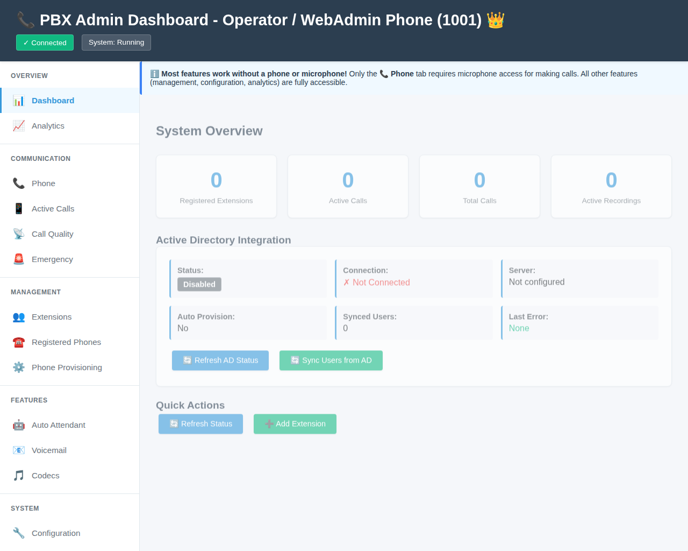

# Admin vs User Screen Usage Guide

## Overview

The PBX admin panel now provides different interfaces for admin and regular users:
- **Admin users** see all management features
- **Regular users** see only Phone and Voicemail features

## Accessing the Admin Panel

### For Admin Extensions

Access the admin panel with your admin extension number:

```
http://your-server:8080/admin/?ext=1001
```

Replace `1001` with your actual admin extension number.

**What you'll see:**
- Header: "📞 PBX Admin Dashboard - [Your Name] ([Extension]) 👑"
- Full sidebar with all sections: Overview, Communication, Management, Features, System
- All tabs: Dashboard, Analytics, Extensions, Phones, Provisioning, Auto Attendant, Calls, QoS, Emergency, Codecs, Configuration
- Default view: Dashboard with system overview

### For Regular Extensions

Access the admin panel with your regular extension number:

```
http://your-server:8080/admin/?ext=1002
```

Replace `1002` with your actual extension number.

**What you'll see:**
- Header: "📞 PBX User Panel - Extension [Number]"
- Welcome banner: "Welcome, [Your Name]! You have access to the 📞 Phone and 📧 Voicemail features."
- Limited sidebar with only: Communication (Phone) and Features (Voicemail) sections
- Only 2 tabs: Phone and Voicemail
- Default view: Phone tab for making calls

## URL Parameter Details

The admin panel uses the `ext` URL parameter to identify the current user:

- **First visit**: If no `ext` parameter is provided, you'll be prompted to enter your extension number
- **Subsequent visits**: Your extension number is saved in browser localStorage
- **Switching users**: Simply change the `ext` parameter in the URL or clear localStorage

## Features Available to Each Role

### Admin Extensions (`is_admin = true`)

Have access to ALL features:

**Overview:**
- 📊 Dashboard - System overview and statistics
- 📈 Analytics - Call analytics and reports

**Communication:**
- 📞 Phone - WebRTC browser calling
- 📱 Active Calls - View active calls
- 📡 Call Quality - QoS monitoring
- 🚨 Emergency - Emergency notification system

**Management:**
- 👥 Extensions - Add/edit/delete extensions
- ☎️ Registered Phones - View SIP registrations
- ⚙️ Phone Provisioning - Auto-provisioning setup

**Features:**
- 🤖 Auto Attendant - IVR configuration
- 📧 Voicemail - Visual voicemail management
- 🎵 Codecs - Audio/video codec settings

**System:**
- 🔧 Configuration - System configuration

### Regular Extensions (`is_admin = false`)

Have access to LIMITED features:

**Communication:**
- 📞 Phone - WebRTC browser calling

**Features:**
- 📧 Voicemail - Visual voicemail (own mailbox only)

## Managing Admin Privileges

### Via Admin Panel

1. Access as an admin extension
2. Go to Extensions tab
3. Click "✏️ Edit" on any extension
4. Check or uncheck "Admin Privileges"
5. Click "Update Extension"

### Via API

Grant admin privileges:
```bash
curl -X PUT http://localhost:8080/api/extensions/1002 \
  -H "Content-Type: application/json" \
  -d '{"is_admin": true}'
```

Revoke admin privileges:
```bash
curl -X PUT http://localhost:8080/api/extensions/1002 \
  -H "Content-Type: application/json" \
  -d '{"is_admin": false}'
```

### Via Database

Using SQLite:
```bash
sqlite3 pbx.db "UPDATE extensions SET is_admin = 1 WHERE number = '1002';"
```

Using PostgreSQL:
```sql
UPDATE extensions SET is_admin = TRUE WHERE number = '1002';
```

## Security Notes

⚠️ **Important Security Considerations:**

1. **Current Implementation (Phase 2):**
   - Provides visual separation between admin and user interfaces
   - Role is determined by URL parameter
   - Users can change the `ext` parameter to access different views
   - API endpoints are NOT protected

2. **Not Suitable For:**
   - Production environments
   - Internet-facing systems
   - Untrusted networks
   - Systems with sensitive data

3. **Suitable For:**
   - Development and testing
   - Internal trusted networks
   - Demonstrations
   - UI preparation for future authentication

4. **For Production Use:**
   - Phase 3 (Authentication & Authorization) must be implemented
   - Requires login page with password verification
   - Requires session management with secure tokens
   - Requires API endpoint protection
   - See `ADMIN_ACCESS_IMPLEMENTATION_STATUS.md` for details

## Troubleshooting

### Extension Not Found

**Problem**: "Extension [number] not found, defaulting to guest mode"

**Solution**: 
- Verify the extension exists in the database
- Check the extension number is correct
- Use the Extensions tab (as admin) to view all extensions

### Always Prompted for Extension

**Problem**: Browser keeps asking for extension number

**Solution**:
- Use the URL parameter: `?ext=1001`
- Check browser localStorage is enabled
- Try clearing browser cache and cookies

### Can't Access Admin Features

**Problem**: Only see Phone and Voicemail tabs

**Solution**:
- Verify your extension has `is_admin = true` in database:
  ```bash
  sqlite3 pbx.db "SELECT number, name, is_admin FROM extensions WHERE number = '1001';"
  ```
- Contact your admin to grant admin privileges
- Make sure you're using the correct extension number in URL

### Header Shows Wrong Information

**Problem**: Header displays incorrect name or extension

**Solution**:
- Clear browser localStorage
- Reload the page with correct `?ext=` parameter
- Check extension data in database is correct

## Screenshots

### Admin View


Admin users see:
- Crown (👑) indicator in header
- All sidebar sections visible
- Full system overview dashboard
- All management features accessible

### Regular User View


Regular users see:
- User panel header
- Welcome banner with feature explanation
- Only Phone and Voicemail tabs
- Limited sidebar sections
- Default Phone view for making calls

## Related Documentation

- [ADMIN_EXTENSION_ACCESS_CONTROL.md](ADMIN_EXTENSION_ACCESS_CONTROL.md) - Detailed admin access control guide
- [ADMIN_ACCESS_IMPLEMENTATION_STATUS.md](ADMIN_ACCESS_IMPLEMENTATION_STATUS.md) - Implementation status and next steps
- [EXTENSION_DATABASE_GUIDE.md](EXTENSION_DATABASE_GUIDE.md) - Extension database management
- [API_DOCUMENTATION.md](API_DOCUMENTATION.md) - REST API reference
