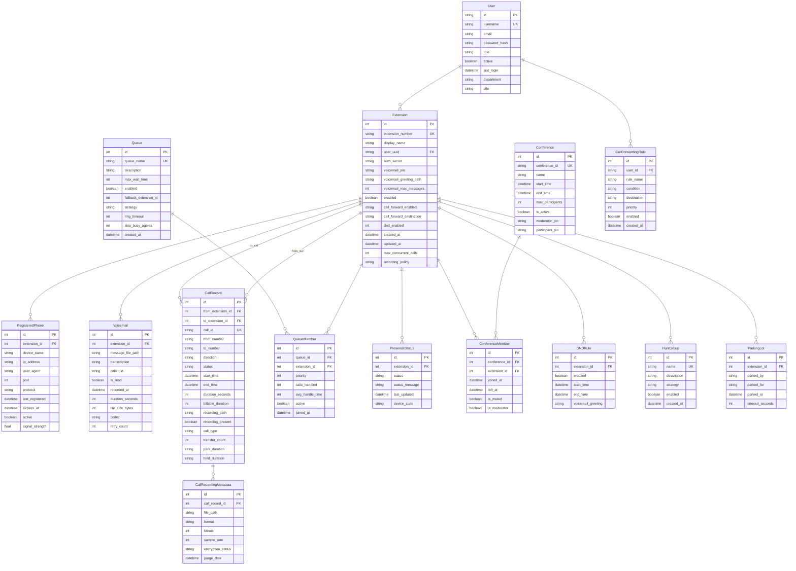
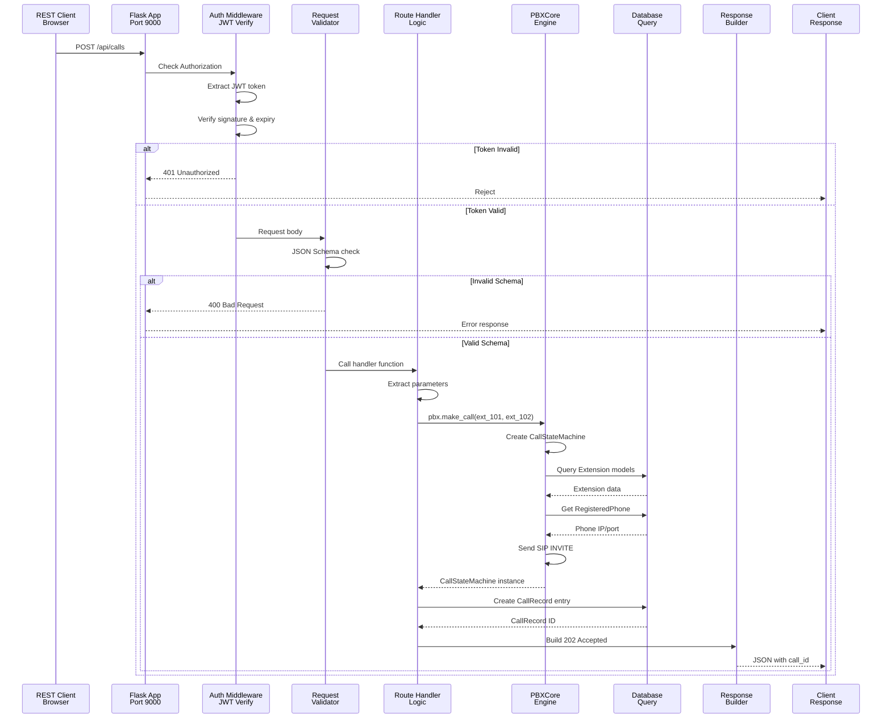
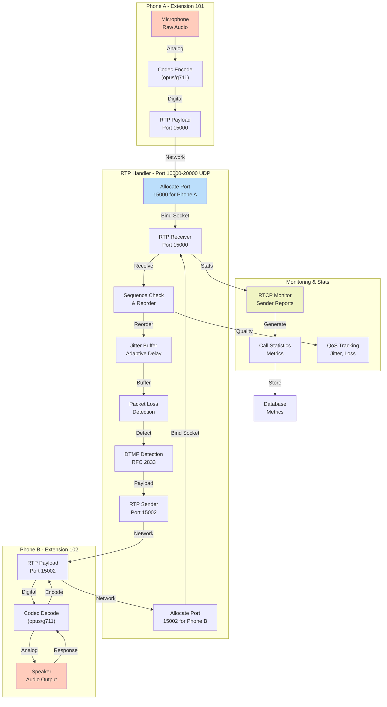
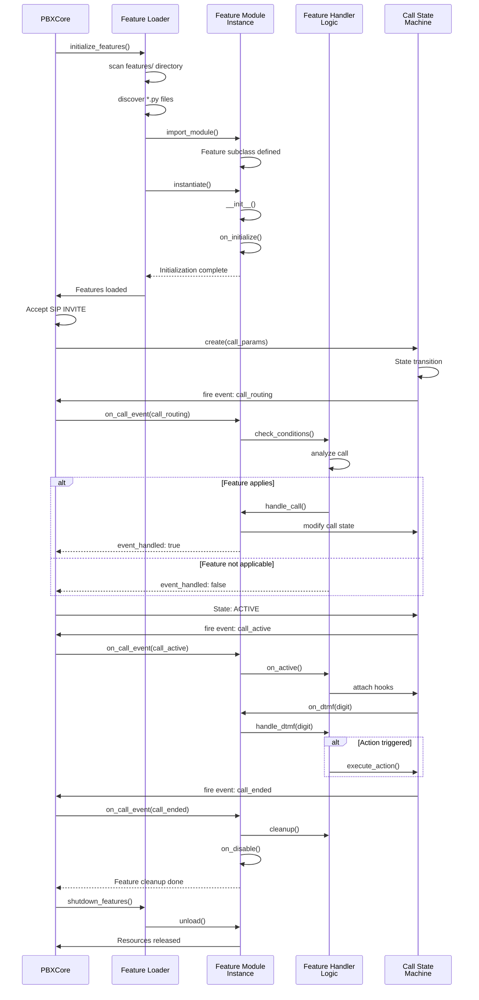
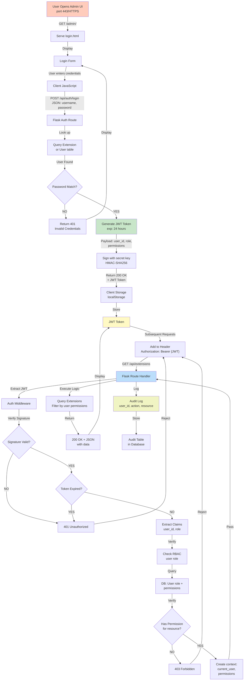
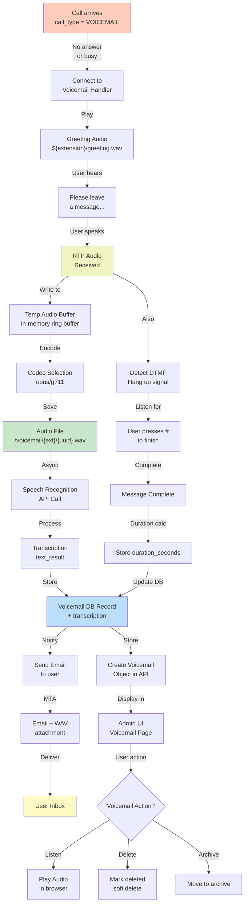
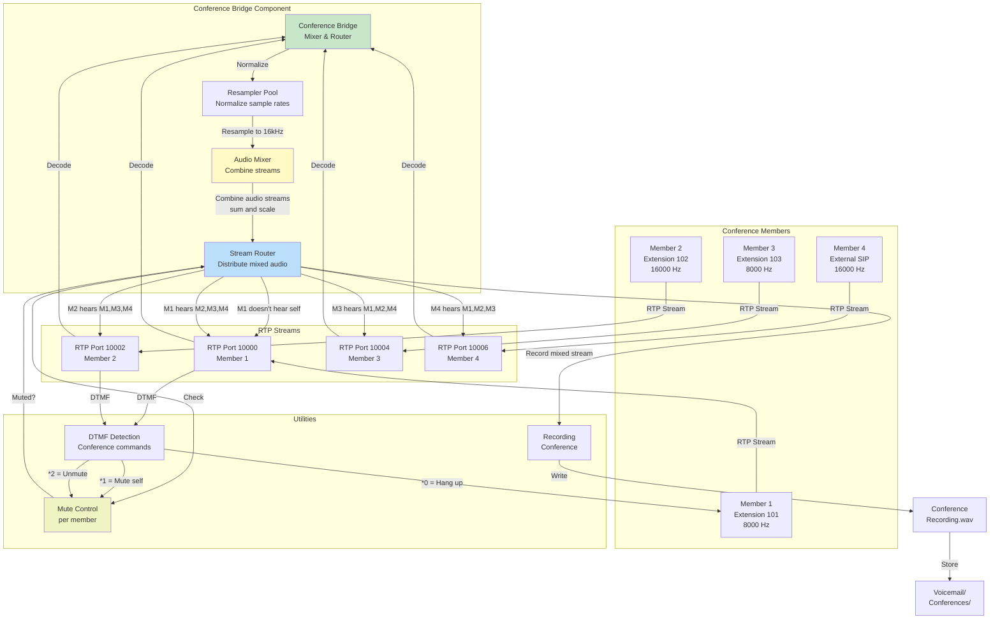
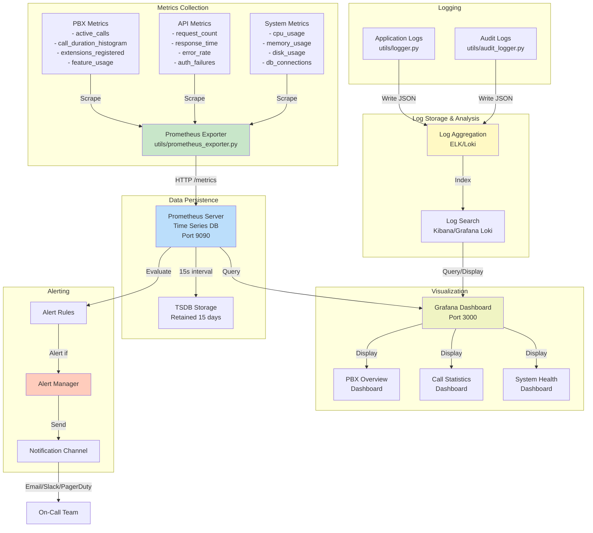

# Warden VoIP - Detailed Component Diagrams

## 1. Module Dependency Graph - Core System

```mermaid
graph TD
    Main["main.py<br/>(Entry Point)"]

    subgraph "Configuration & Initialization"
        EnvLoader["utils/env_loader.py<br/>(Load .env)"]
        ConfigMgr["utils/config.py<br/>(Parse YAML)"]
        Logger["utils/logger.py<br/>(Setup Logging)"]
    end

    subgraph "Database Layer"
        DB["utils/database.py<br/>(SQLAlchemy)"]
        Models["models/__init__.py<br/>(ORM Models)"]
        Migrations["utils/migrations.py<br/>(Runtime DDL)"]
    end

    subgraph "PBX Core"
        PBXCore["core/pbx.py<br/>(PBXCore)"]
        CallRouter["core/call_router.py<br/>(Routing)"]
        CallStateMachine["core/call.py<br/>(State Machine)"]
        FeatureInit["core/feature_initializer.py<br/>(Feature Loader)"]
    end

    subgraph "Protocol Handlers"
        SIPServer["sip/server.py<br/>(Twisted SIP)"]
        SIPMessage["sip/message.py<br/>(SIP Parser)"]
        SDP["sip/sdp.py<br/>(SDP Negotiation)"]
        RTPHandler["rtp/handler.py<br/>(RTP Relay)"]
        JitterBuffer["rtp/jitter_buffer.py"]
        RFC2833["rtp/rfc2833.py<br/>(DTMF)"]
        RTCPMonitor["rtp/rtcp_monitor.py"]
    end

    subgraph "Feature Handlers"
        AutoAttendant["core/auto_attendant_handler.py<br/>(IVR)"]
        VoicemailHandler["core/voicemail_handler.py"]
        EmergencyHandler["core/emergency_handler.py<br/>(E911)"]
        PagingHandler["core/paging_handler.py"]
        Features["features/*.py<br/>(77 Modules)"]
    end

    subgraph "API Layer"
        FlaskApp["api/app.py<br/>(Flask Factory)"]
        Routes["api/routes/*.py<br/>(23 Modules)"]
        Schemas["api/schemas/*.py<br/>(5 Schema Modules)"]
        Auth["api/routes/auth.py<br/>(JWT)"]
        Errors["api/errors.py<br/>(Error Handler)"]
        OpenAPI["api/openapi.py"]
    end

    subgraph "Security & Monitoring"
        Security["utils/security.py<br/>(Encryption)"]
        TLS["utils/tls_support.py"]
        Middleware["utils/security_middleware.py"]
        Monitor["utils/security_monitor.py"]
        Metrics["utils/prometheus_exporter.py<br/>(Metrics)"]
        AuditLog["utils/audit_logger.py"]
    end

    subgraph "Integrations"
        AD["integrations/active_directory.py"]
        Teams["integrations/teams.py"]
        Zoom["integrations/zoom.py"]
        CRM["integrations/espocrm.py"]
    end

    subgraph "Utilities"
        GracefulShutdown["utils/graceful_shutdown.py"]
        Audio["utils/audio_processor.py"]
        TTS["utils/tts_provider.py"]
        DTMF["utils/dtmf_handler.py"]
    end

    Main -->|Load Config| EnvLoader
    EnvLoader -->|Load Settings| ConfigMgr
    ConfigMgr -->|Initialize| Logger

    ConfigMgr -->|Connect| DB
    DB -->|Create ORM| Models
    Models -->|Create Tables| Migrations

    Main -->|Initialize| PBXCore
    ConfigMgr -->|Configure| PBXCore
    Models -->|Provide| PBXCore

    PBXCore -->|Own| CallRouter
    PBXCore -->|Own| FeatureInit
    CallRouter -->|Use| CallStateMachine

    PBXCore -->|Start| SIPServer
    SIPServer -->|Parse| SIPMessage
    SIPMessage -->|Negotiate| SDP
    SIPServer -->|Route Messages| PBXCore

    CallStateMachine -->|Handle Media| RTPHandler
    RTPHandler -->|Buffer| JitterBuffer
    RTPHandler -->|Detect DTMF| RFC2833
    RTPHandler -->|Monitor Quality| RTCPMonitor

    FeatureInit -->|Load| AutoAttendant
    FeatureInit -->|Load| VoicemailHandler
    FeatureInit -->|Load| EmergencyHandler
    FeatureInit -->|Load| PagingHandler
    FeatureInit -->|Load| Features

    PBXCore -->|Trigger Events| Features

    Main -->|Create| FlaskApp
    FlaskApp -->|Inject| PBXCore
    FlaskApp -->|Register| Routes
    Routes -->|Validate| Schemas
    Routes -->|Check| Auth
    Routes -->|Catch Errors| Errors
    FlaskApp -->|Document| OpenAPI

    Routes -->|Query| PBXCore
    Routes -->|Access| Models

    PBXCore -->|Encrypt Data| Security
    Security -->|Use| TLS
    FlaskApp -->|Apply| Middleware
    FlaskApp -->|Monitor| Monitor
    Routes -->|Log| AuditLog

    PBXCore -->|Sync| AD
    PBXCore -->|Integrate| Teams
    PBXCore -->|Integrate| Zoom
    PBXCore -->|Integrate| CRM

    CallStateMachine -->|Use| Audio
    CallStateMachine -->|Generate| TTS
    CallStateMachine -->|Handle| DTMF
    PBXCore -->|Graceful| GracefulShutdown

    style Main fill:#ffccbc
    style PBXCore fill:#c8e6c9
    style FlaskApp fill:#bbdefb
    style SIPServer fill:#f0f4c3
    style Features fill:#fff9c4
```



## 2. Database Schema - Complete ERD



## 3. Request Processing Pipeline - Detailed



## 4. RTP Media Stream - Detailed Flow



## 5. Call State Machine - Full State Diagram

```mermaid
stateDiagram-v2
    [*] --> NEW

    NEW --> ROUTING: analyze_destination()

    ROUTING --> QUEUED: destination_is_queue
    ROUTING --> RINGING: destination_is_extension
    ROUTING --> IVR: destination_is_ivr
    ROUTING --> VOICEMAIL: destination_is_voicemail
    ROUTING --> CONFERENCE: destination_is_conference
    ROUTING --> FAILED: invalid_destination

    QUEUED --> RINGING: agent_available
    QUEUED --> HELD: no_agent
    HELD --> QUEUED: agent_available
    HELD --> VOICEMAIL: timeout

    RINGING --> ACTIVE: 200_OK_received
    RINGING --> BUSY: 486_received
    RINGING --> NO_ANSWER: timeout

    IVR --> RINGING: user_selected_extension
    IVR --> VOICEMAIL: user_pressed_voicemail
    IVR --> FAILED: invalid_selection

    ACTIVE --> HELD: hold_request
    HELD --> ACTIVE: unhold_request
    ACTIVE --> TRANSFER_INITIATED: transfer_request
    TRANSFER_INITIATED --> TRANSFER_COMPLETED: transfer_accepted
    TRANSFER_INITIATED --> ACTIVE: transfer_rejected

    ACTIVE --> RECORDED: recording_started
    RECORDED --> ACTIVE: recording_stopped

    ACTIVE --> CONFERENCE: conference_transfer
    CONFERENCE --> ACTIVE: conference_exit

    ACTIVE --> ENDED: bye_received
    NO_ANSWER --> VOICEMAIL: voicemail_enabled
    NO_ANSWER --> ENDED: voicemail_disabled
    BUSY --> VOICEMAIL: voicemail_enabled
    BUSY --> ENDED: voicemail_disabled
    VOICEMAIL --> ENDED: recording_complete
    TRANSFER_COMPLETED --> ENDED: call_complete
    CONFERENCE --> ENDED: conference_complete
    FAILED --> ENDED: immediate

    ENDED --> [*]: create_cdr()

    note right of NEW
        Created when SIP INVITE arrives
        Allocate call_id, initialize handlers
    end

    note right of ROUTING
        Determine destination type:
        - Extension lookup
        - Queue routing
        - IVR menu
        - Direct to voicemail
    end

    note right of RINGING
        SIP 180 RINGING sent
        Waiting for 200 OK
        Timeout after ring_timeout seconds
    end

    note right of ACTIVE
        Call in progress
        Media streams flowing
        Features active (hold, transfer, record)
    end

    note right of HELD
        Call on hold
        Music on Hold (MoH) playing
        Can resume or transfer
    end

    note right of VOICEMAIL
        Recording voicemail greeting played
        Recording message to storage
        Optional transcription
    end

    note right of TRANSFER_INITIATED
        Blind or attended transfer
        New call leg created
        Awaiting acceptance
    end

    note right of ENDED
        Call terminated
        Generate CallRecord CDR
        Publish call_ended event
        Release resources
    end
```

## 6. Feature Module Lifecycle



## 7. Authentication & Authorization Flow



## 8. Voicemail Processing Pipeline



## 9. Conference Bridge Architecture



## 10. System Monitoring & Observability Stack



---

## Summary

These diagrams provide comprehensive views of:

1. **Module Dependencies**: How all backend components interconnect
2. **Database Design**: Complete entity relationships and schema
3. **Request Processing**: End-to-end REST API flow
4. **RTP Media**: Low-level audio stream handling
5. **State Machine**: Call lifecycle with all transitions
6. **Feature Lifecycle**: How 77 feature modules work
7. **Authentication**: JWT, RBAC, and authorization
8. **Voicemail**: Message recording, storage, and retrieval
9. **Conference**: Multi-party mixing and routing
10. **Observability**: Monitoring, metrics, logs, and alerts

Together with the main architecture document, these provide a complete technical picture of Warden VoIP.
