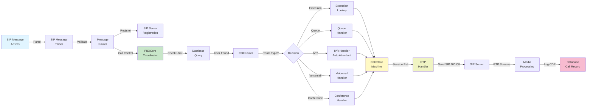
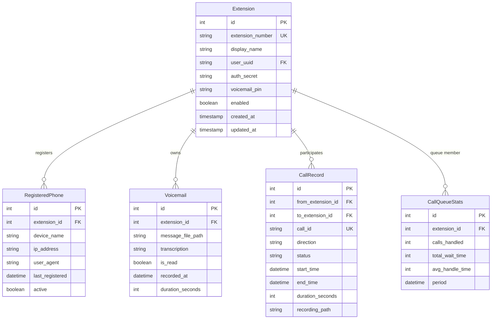
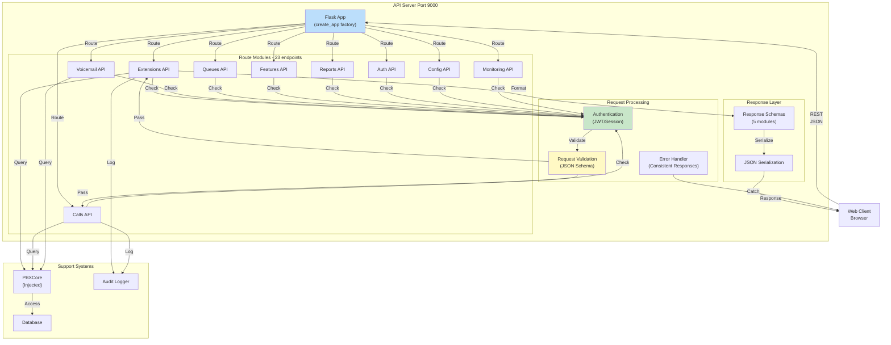
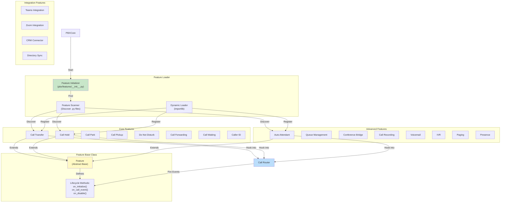
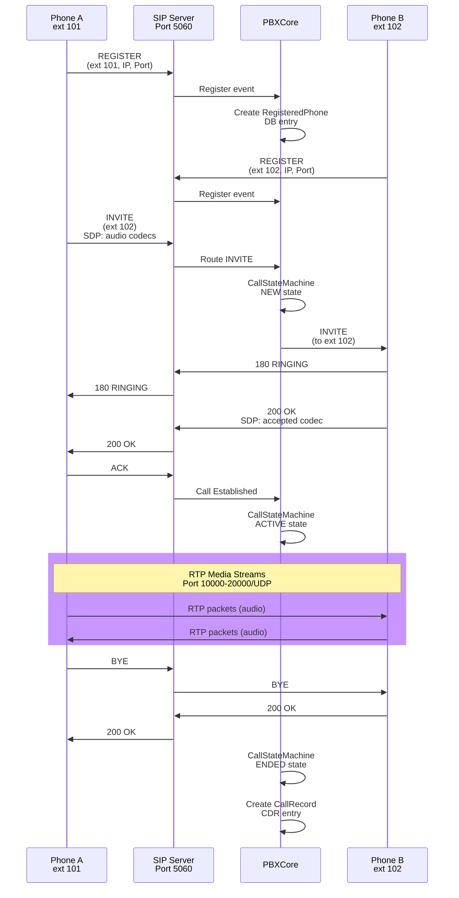
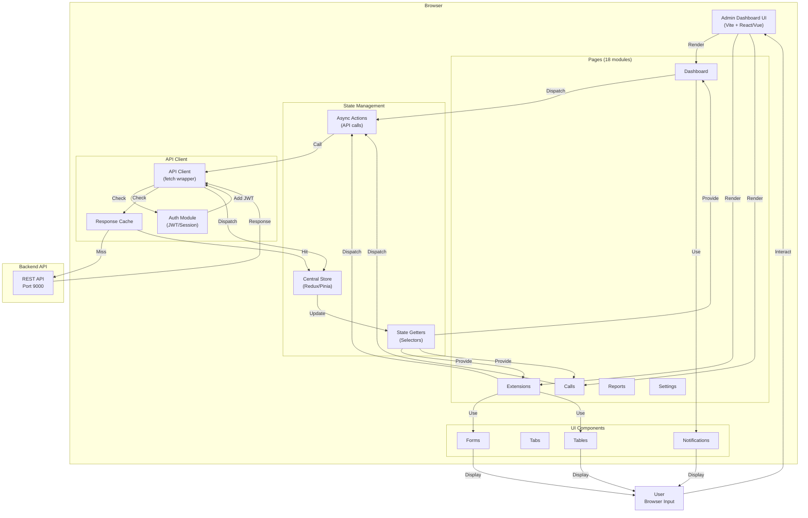
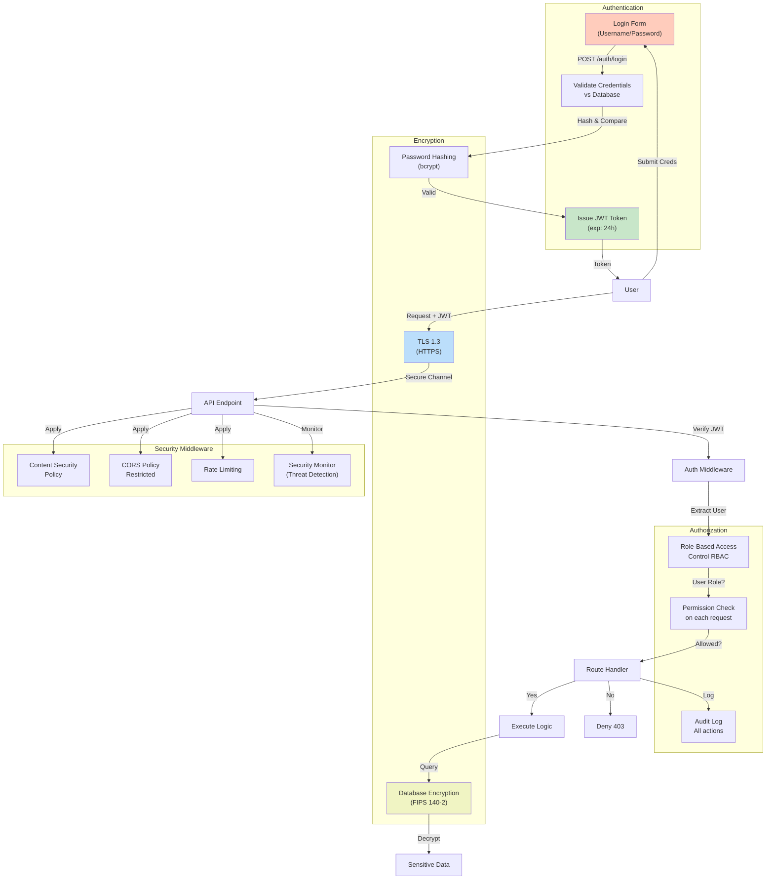
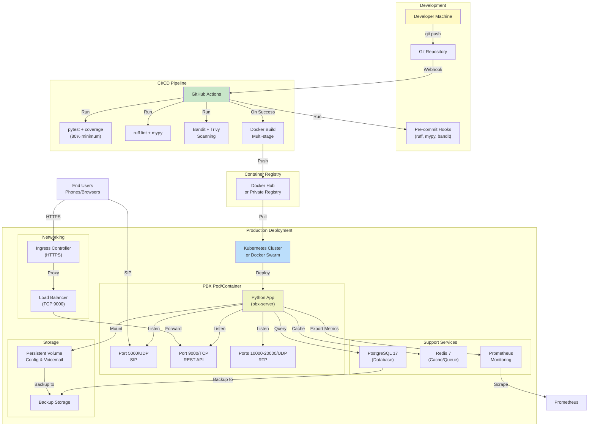

# Warden VoIP System Architecture Diagrams

## 1. High-Level System Overview

```mermaid
graph TB
    subgraph "External Systems"
        SIP_Trunks["SIP Trunks<br/>(AT&T, Comcast, etc)"]
        PSTN["PSTN"]
        WebUI["Web Browsers"]
        Phones["IP Phones<br/>(Registered Devices)"]
    end

    subgraph "Warden VoIP PBX"
        subgraph "Network Layer"
            SIP_Server["SIP Server<br/>(Twisted-based)<br/>Port 5060/UDP"]
            RTP_Handler["RTP Handler<br/>(Media Relay)<br/>Ports 10000-20000/UDP"]
        end

        subgraph "Core Engine"
            PBX_Core["PBXCore<br/>(Central Coordinator)"]
            CallRouter["Call Router"]
            CallStateMachine["Call State Machine"]
            FeatureInitializer["Feature Initializer<br/>(77 Modules)"]
        end

        subgraph "Features & Handlers"
            IVR["Auto Attendant<br/>(IVR)"]
            Voicemail["Voicemail Handler"]
            Queue["Call Queue"]
            Conference["Conference Bridge"]
            Paging["Overhead Paging"]
        end

        subgraph "REST API Layer"
            Flask_App["Flask App<br/>(Port 9000/TCP)"]
            API_Routes["23 Route Modules"]
            Auth["Authentication<br/>& Authorization"]
        end

        subgraph "Data Layer"
            Database["Database<br/>(PostgreSQL/SQLite)"]
            Models["ORM Models<br/>(SQLAlchemy)"]
            Migrations["Runtime Migrations"]
        end

        subgraph "Supporting Services"
            Config["Config Manager<br/>(YAML)"]
            Logger["Logger & Audit"]
            Security["Security<br/>& Encryption"]
            Metrics["Prometheus<br/>Exporter"]
        end

        subgraph "Integrations"
            AD["Active Directory"]
            Teams["Teams/Zoom/Jitsi"]
            CRM["Espo CRM"]
            Other["Other 3rd Party"]
        end
    end

    subgraph "Frontend"
        AdminUI["Admin Dashboard<br/>(Vite/TypeScript)<br/>Port 80/443"]
        State["State Management<br/>(Store)"]
        Pages["18 Page Modules"]
    end

    subgraph "External Services"
        TTS["Text-to-Speech<br/>(espeak, etc)"]
        Audio["Audio Processing<br/>(ffmpeg)"]
    end

    SIP_Trunks -->|SIP Messages| SIP_Server
    Phones -->|SIP Register/Call| SIP_Server
    SIP_Server -->|Process| PBX_Core
    PBX_Core -->|Route & Handle| CallRouter
    CallRouter -->|State Management| CallStateMachine
    FeatureInitializer -->|Load Features| IVR
    FeatureInitializer -->|Load Features| Voicemail
    FeatureInitializer -->|Load Features| Queue
    FeatureInitializer -->|Load Features| Conference

    CallStateMachine -->|Media| RTP_Handler
    RTP_Handler -->|RTP Streams| Phones
    RTP_Handler -->|RTP Streams| SIP_Trunks

    Flask_App -->|Manage| API_Routes
    API_Routes -->|Auth Check| Auth
    API_Routes -->|Query/Update| Models
    Models -->|ORM| Database
    Models -->|Create Tables| Migrations

    Config -->|Configure| PBX_Core
    Logger -->|Log| Database
    Security -->|Encrypt| Database
    Metrics -->|Export| Prometheus

    WebUI -->|HTTPS| AdminUI
    AdminUI -->|State| State
    State -->|Manage| Pages
    AdminUI -->|REST API| Flask_App

    PBX_Core -->|Sync| AD
    PBX_Core -->|Interop| Teams
    PBX_Core -->|Integration| CRM
    PBX_Core -->|Connect| Other

    CallStateMachine -->|Generate Audio| TTS
    RTP_Handler -->|Process| Audio
```

## 2. Core Engine - Request Flow Diagram

## 3. Database Schema & Data Model

## 4. API Layer Architecture

## 5. Feature Module System

## 6. SIP Protocol Flow - Call Setup

## 7. Frontend State Management & Data Flow

## 8. Security & Authentication Architecture

## 9. Deployment & Runtime Architecture

## 10. Call Processing Pipeline

```mermaid
graph LR
    subgraph "Step 1: Arrival"
        A["SIP Message<br/>arrives at port 5060"]
        B["Parse message<br/>extract headers"]
    end

    subgraph "Step 2: Authentication"
        C["Extract User ID<br/>from Request-URI"]
        D["Lookup in Database<br/>verify exists"]
    end

    subgraph "Step 3: Routing"
        E["Call Router<br/>analyzes destination"]
        F{Destination Type?}
        F -->|Extension| G["User Lookup"]
        F -->|Queue| H["Queue Handler"]
        F -->|IVR| I["IVR Handler"]
        F -->|VM| J["Voicemail"]
    end

    subgraph "Step 4: State Machine"
        K["Create CallStateMachine<br/>instance"]
        L["Transition: NEW"]
        M["Transition: RINGING"]
        N["Transition: ACTIVE"]
    end

    subgraph "Step 5: Media"
        O["RTP Handler<br/>allocate port"]
        P["Media Relay<br/>between peers"]
        Q["DTMF Detection<br/>RFC 2833"]
    end

    subgraph "Step 6: Features"
        R["Feature Hooks<br/>on_call_event"]
        S["Call Recording"]
        T["Call Monitoring"]
        U["Voicemail if no answer"]
    end

    subgraph "Step 7: Termination"
        V["BYE received<br/>or timeout"]
        W["CallStateMachine<br/>ENDED"]
        X["Create CallRecord<br/>CDR"]
        Y["Log Metrics<br/>Audit Trail"]
    end

    A -->|Parse| B
    B -->|Extract| C
    C -->|Validate| D
    D -->|Pass| E
    E -->|Analyze| F
    G -->|Route to| K
    H -->|Route to| K
    I -->|Route to| K
    J -->|Route to| K

    K -->|Init| L
    L -->|INVITE sent| M
    M -->|Answer received| N

    N -->|Start| O
    O -->|Stream| P
    P -->|Detect| Q

    N -->|Trigger| R
    R -->|Hook| S
    R -->|Hook| T
    R -->|Hook| U

    S -->|Active| P
    T -->|Active| P
    U -->|Fallback| P

    P -->|End Signal| V
    V -->|Complete| W
    W -->|Generate| X
    X -->|Record| Y

    style A fill:#ffccbc
    style F fill:#fff9c4
    style K fill:#c8e6c9
    style O fill:#bbdefb
    style R fill:#f0f4c3
    style W fill:#f8bbd0
```

---

## Legend

- **Solid Lines**: Direct data flow or method calls
- **Dashed Lines**: Asynchronous events or callbacks
- **Bold Text**: Key components or decisions
- **Color Coding**:
  - 🔴 Network/Protocol layer
  - 🟢 Core engine
  - 🟡 State/Configuration
  - 🔵 API/REST layer
  - 🟠 Features/Integrations
  - 🟣 Storage/Database

## Architecture Principles

1. **Layered Design**: Clear separation between protocol (SIP/RTP), core logic, API, and frontend
2. **Pluggable Features**: 77 feature modules can be enabled/disabled independently
3. **Database-Backed**: All state persists to PostgreSQL or SQLite
4. **Stateless API**: REST API can scale horizontally
5. **Real-time Events**: SIP server processes calls synchronously; API handles async requests
6. **Security-First**: TLS, authentication, authorization, and encryption at all layers
